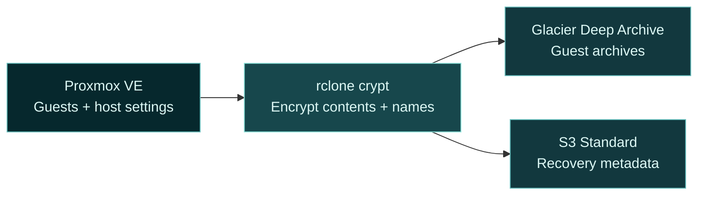

<div align="center">


**Cold backups. Clear recovery.**

<kbd>Proxmox VE</kbd> &nbsp; <kbd>Encrypted off-site backups</kbd> &nbsp; <kbd>MIT licensed</kbd>

[**Get started →**](#quick-start) &nbsp; · &nbsp; [Recovery guide](docs/guide.md#restore-a-guest) &nbsp; · &nbsp; [What's new](CHANGELOG.md)

</div>

---

FrostKeep backs up Proxmox VMs and containers to **AWS S3 Glacier Deep Archive**. Guest archives, host configuration and recovery metadata are encrypted through rclone crypt. Recovery metadata stays immediately readable.

For long-term off-site copies alongside local backups. Allow time for AWS retrieval before downloading a guest archive.

> [!IMPORTANT]
> **Pre-release.** Validate a complete backup and a real restore on your installation before relying on FrostKeep. Keep your local backups and an independent copy of your encryption keys.

## What you get

<table>
<tr>
<td width="50%"><strong>🔐 Encryption before upload</strong><br>rclone crypt protects contents and names.</td>
<td width="50%"><strong>📦 One archive per guest</strong><br>Recover one VM or container independently.</td>
</tr>
<tr>
<td><strong>✓ Completion you can check</strong><br>Checksums and coverage checks distinguish complete backups from partial runs.</td>
<td><strong>↻ A way back after interruption</strong><br>Reuse verified uploads after interruption. Cleanup stays explicit.</td>
</tr>
<tr>
<td><strong>🔔 Alerts on your terms</strong><br>Optional Discord, Slack or HTTPS alerts for failures and overdue backups.</td>
<td><strong>🧊 Recovery with control</strong><br>Verified downloads. Restore to an unused guest ID, kept stopped.</td>
</tr>
</table>

## From your host to cold storage



## Quick start

**1. Prepare your storage.** Configure private S3 and rclone crypt using the [setup guide](docs/guide.md#storage-and-keys). Save your recovery keys independently.

<details>
<summary><strong>Check the requirements</strong></summary>

- A supported Proxmox VE installation with root access.
- Python 3.10+, rclone, GNU tar, zstd and `setfacl` from the `acl` package.
- Snapshot support for included container volumes.
- Staging space for your largest compressed dump, retained failed files and the configured reserve.

No Python packages to install.

</details>

**2. Install and check.** From the reviewed release directory:

```sh
sudo bash scripts/install.sh
sudoedit /etc/frostkeep/config.json
sudo chmod 600 /etc/frostkeep/config.json /root/.config/rclone/rclone.conf
sudo frostkeep backup --check
```

Preflight creates no backups or uploads. Existing installations: follow the [migration steps](docs/guide.md#existing-installations).

**3. Back up one guest.** Replace `101` with an included guest ID:

```sh
sudo frostkeep backup 101
sudo frostkeep status
sudo frostkeep restore list
```

Rehearse [recovery](docs/guide.md#restore-a-guest), then enable [scheduling and alerts](docs/guide.md#schedule-and-alerts). Installation does not activate a scheduler.

<details>
<summary><strong>Everyday commands</strong></summary>

| Task | Command |
| --- | --- |
| Back up all included guests | `frostkeep backup` |
| Check backup freshness | `frostkeep health --notify` |
| Inspect a completed backup | `frostkeep restore inspect RUN_ID` |
| Review an interrupted run | `frostkeep resume RUN_ID` |
| Review local cleanup | `frostkeep cleanup RUN_ID` |

Add `--execute` to apply resume or cleanup plans. Subset runs do not reset freshness. FrostKeep never deletes cloud objects or starts restored guests.

</details>

---

<div align="center">

[Setup & recovery](docs/guide.md) · [Security](SECURITY.md) · [Contributing](CONTRIBUTING.md) · [MIT license](LICENSE)

Copyright FrostKeep contributors

</div>
