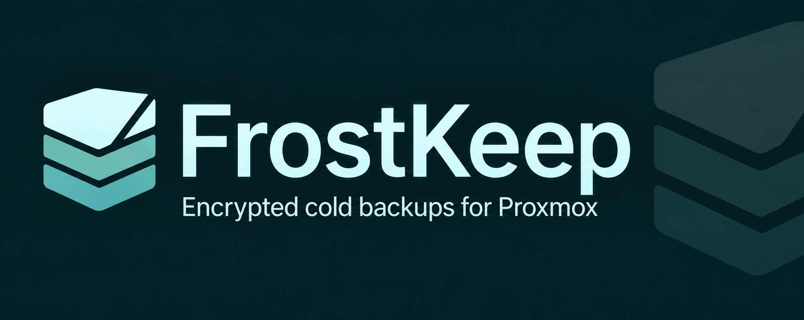
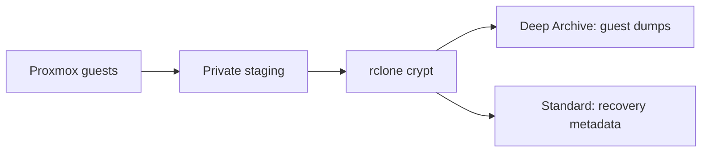

<div align="center">



**Independent guest archives. Encrypted off-site storage. Recovery you can rehearse.**

<kbd>Proxmox VE</kbd> &nbsp; <kbd>rclone crypt</kbd> &nbsp; <kbd>Glacier Deep Archive</kbd> &nbsp; <kbd>MIT</kbd>

[Quick start](#quick-start) · [Setup & recovery guide](docs/guide.md) · [Security](SECURITY.md)

</div>

---

FrostKeep backs up Proxmox VMs and containers to **AWS S3 Glacier Deep Archive**. File contents, filenames and directory names are encrypted through rclone crypt. Each guest has its own archive; host configuration, logs and checksum manifests stay encrypted in **S3 Standard** for immediate access.

> [!IMPORTANT]
> **Pre-release.** Test a complete backup and a real restore on your installation before relying on FrostKeep. Keep your regular local backups and an independent copy of your encryption keys. Deep Archive retrieval must finish before a guest archive can be downloaded.

## Why FrostKeep?

- **One archive per guest** — recover a VM or container independently.
- **Verifiable completion** — checksums, guest coverage checks and a final completion marker.
- **Recoverable interruptions** — resume reuses verified uploads; cleanup is explicit.
- **Controlled restores** — verify downloads, then restore to an unused guest ID, stopped.
- **Private configuration** — credentials and optional webhook settings stay on your host.
- **Small runtime** — Python's standard library, Proxmox and rclone.



## Quick start

Requires a supported Proxmox VE installation, root access, Python 3.10+, rclone, GNU tar, zstd and `setfacl` from the `acl` package. Included container volumes must support snapshots. Provision enough staging space for the largest compressed dump plus retained failed files and your reserve.

1. Configure an AWS S3 remote wrapped by a crypt remote named `archive`, with content and name encryption enabled. Save your recovery keys independently.
2. Install from the reviewed release and edit the private configuration:

   ```sh
   sudo bash scripts/install.sh
   sudoedit /etc/frostkeep/config.json
   sudo chmod 600 /etc/frostkeep/config.json /root/.config/rclone/rclone.conf
   sudo frostkeep backup --check
   ```

3. Back up one guest, replacing `101` with an included guest ID:

   ```sh
   sudo frostkeep backup 101
   sudo frostkeep status
   sudo frostkeep restore list
   ```

Follow the [guide](docs/guide.md) to rehearse recovery, configure alerts and enable scheduling. Installation does not activate a scheduler. Migrate existing installations using the guide so exclusions and scheduling are preserved.

## Everyday commands

| Task | Command |
| --- | --- |
| Preflight only | `frostkeep backup --check` |
| Back up included guests | `frostkeep backup` |
| Status and freshness | `frostkeep status` · `frostkeep health --notify` |
| Review recovery | `frostkeep resume RUN_ID` |
| Review local cleanup | `frostkeep cleanup RUN_ID` |
| Inspect a completed backup | `frostkeep restore inspect RUN_ID` |

Resume and cleanup require `--execute` to make changes. Subset backups do not reset full-backup freshness. FrostKeep never deletes cloud objects or automatically starts restored guests.

[Setup & recovery](docs/guide.md) · [Contributing](CONTRIBUTING.md) · [Changelog](CHANGELOG.md)

---

<div align="center">

**FrostKeep — Encrypted cold backups for Proxmox.**

[MIT license](LICENSE) · Copyright FrostKeep contributors

</div>
