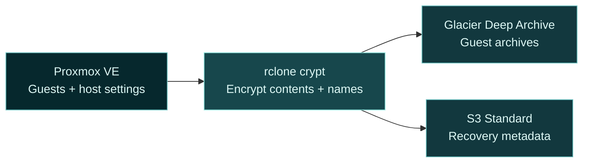

<div align="center">


# FrostKeep · Proxmox backups to AWS Glacier

**Encrypted cold storage. A clear path to recovery.**

[](https://github.com/EMOEMOJAI/FrostKeep/actions/workflows/check.yml)
[](https://github.com/EMOEMOJAI/FrostKeep/releases/latest)
[](LICENSE)

[**Get started →**](#quick-start) &nbsp; · &nbsp; [Recovery guide](docs/guide.md#restore-a-guest) &nbsp; · &nbsp; [What's new](CHANGELOG.md)

</div>

---

FrostKeep is an open-source backup and recovery CLI for **Proxmox VE**, **QEMU virtual machines** and **LXC containers**. It creates independent `vzdump` archives, encrypts them with **rclone crypt**, and uploads them to **Amazon S3 Glacier Deep Archive**.

Keep long-term off-site copies alongside your local backups. Guest archives use Deep Archive; encrypted host configuration and recovery metadata stay in S3 Standard, accessible without an archive retrieval wait.

> [!IMPORTANT]
> Validate a complete backup and a real restore on your installation before relying on FrostKeep. Keep your local backups and an independent copy of your encryption keys.

## Built for the day you need your backup

| Your backup should… | How FrostKeep helps |
| --- | --- |
| **Stay private** | Encrypts file contents, filenames and directory names before upload. |
| **Show what's complete** | Checks guest coverage, upload sizes and storage classes before publishing completion; records SHA-256 checksums for recovery. |
| **Recover one guest** | Retrieves an individual VM or container archive, verifies the download and restores to an unused guest ID, kept stopped. |
| **Handle interruptions** | Reuses verified uploads when resuming; previews local cleanup before applying it. |
| **Tell you when something is wrong** | Optional Discord, Slack or HTTPS notifications for failures and overdue backups. |

Full archives, with no incremental backups or deduplication. Guest recovery requires AWS retrieval time. See [storage costs](docs/guide.md#storage-and-keys) and the [restore workflow](docs/guide.md#restore-a-guest) before choosing your schedule.

## From your host to cold storage



## Quick start

**1. Prepare your storage.** Configure private S3 and rclone crypt using the [setup guide](docs/guide.md#storage-and-keys). Save your recovery keys independently.

<details>
<summary><strong>Check the requirements</strong></summary>

- A supported Proxmox VE installation with root access.
- Python 3.10+, rclone, GNU tar, zstd and `setfacl` from the `acl` package.
- Snapshot support for included container volumes.
- Staging space for your largest compressed dump, retained failed files and the configured reserve.

No Python packages to install.

</details>

**2. Install and check.** From the reviewed release directory:

```sh
sudo bash scripts/install.sh
sudoedit /etc/frostkeep/config.json
sudo chmod 600 /etc/frostkeep/config.json /root/.config/rclone/rclone.conf
sudo frostkeep backup --check
```

Preflight creates no backups or uploads. Existing installations: follow the [migration steps](docs/guide.md#existing-installations).

**3. Back up one guest.** Replace `101` with an included guest ID:

```sh
sudo frostkeep backup 101
sudo frostkeep status
sudo frostkeep restore list
```

Rehearse [recovery](docs/guide.md#restore-a-guest), then enable [scheduling and alerts](docs/guide.md#schedule-and-alerts). Installation does not activate a scheduler.

<details>
<summary><strong>Everyday commands</strong></summary>

| Task | Command |
| --- | --- |
| Back up all included guests | `frostkeep backup` |
| Check backup freshness | `frostkeep health --notify` |
| Inspect a completed backup | `frostkeep restore inspect RUN_ID` |
| Review an interrupted run | `frostkeep resume RUN_ID` |
| Review local cleanup | `frostkeep cleanup RUN_ID` |

Add `--execute` to apply resume or cleanup plans. Subset runs do not reset freshness. FrostKeep never deletes cloud objects or starts restored guests.

</details>

---

<div align="center">

[Setup & recovery](docs/guide.md) · [Security](SECURITY.md) · [Contributing](CONTRIBUTING.md) · [MIT license](LICENSE)

[AI documentation index](llms.txt) · [Coding agent guide](AGENTS.md)

Copyright FrostKeep contributors

</div>
